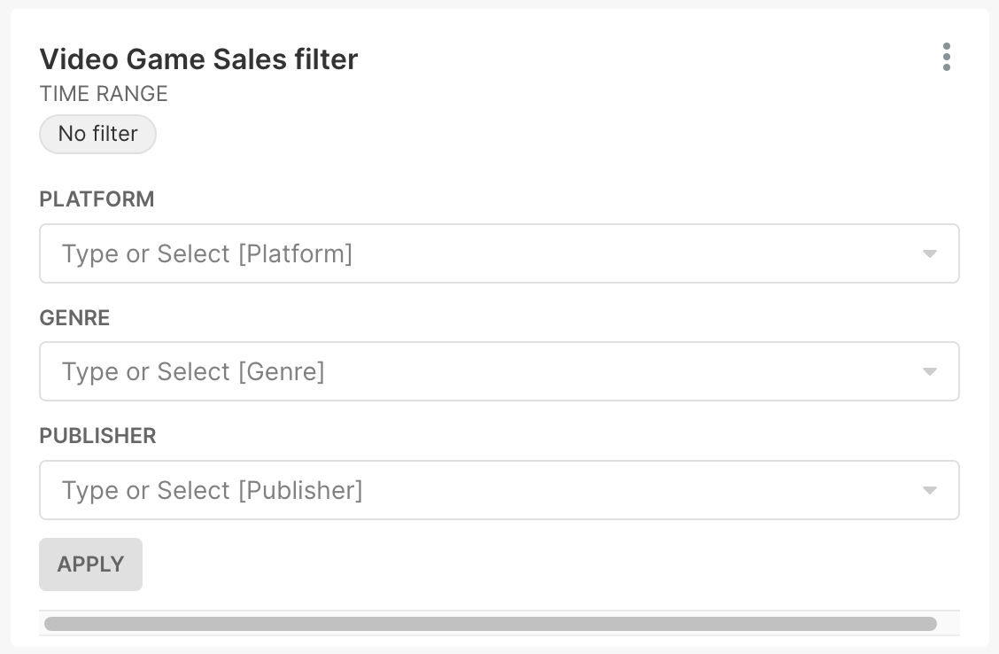
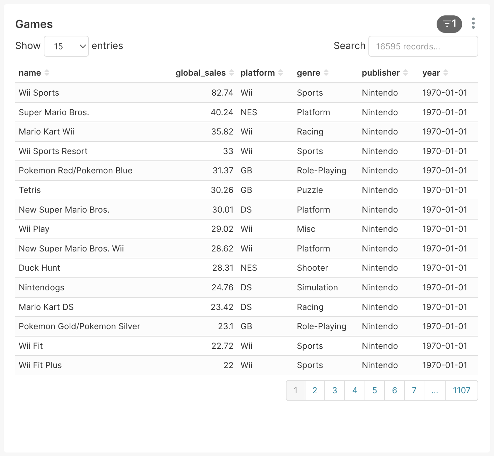
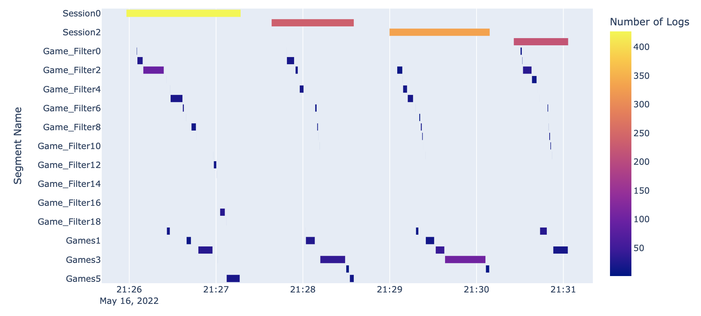
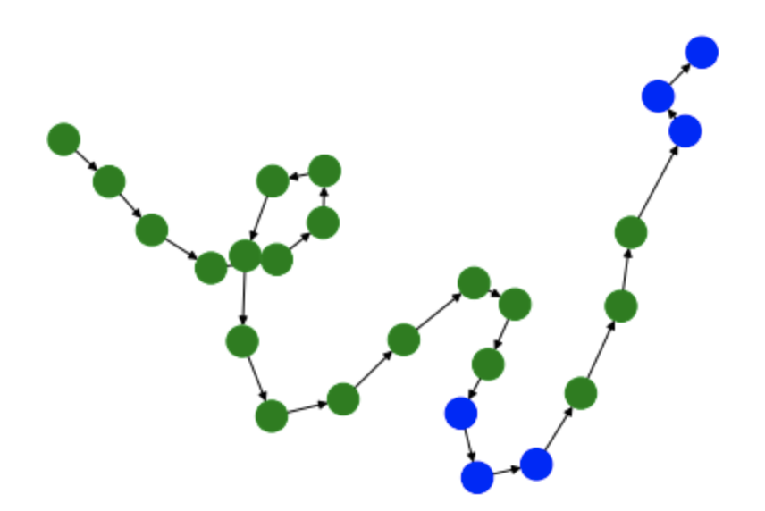
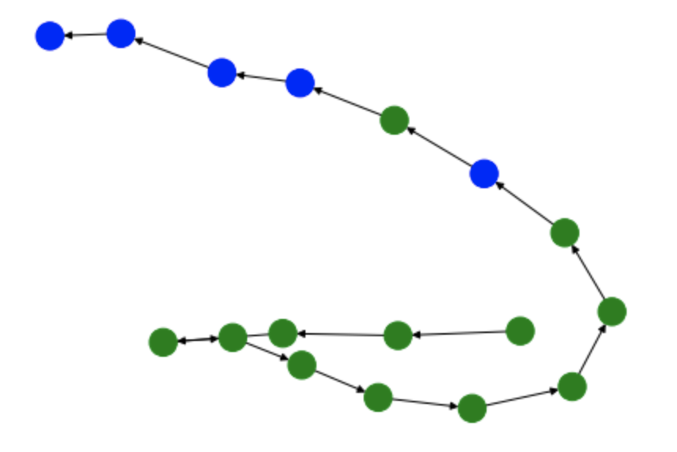
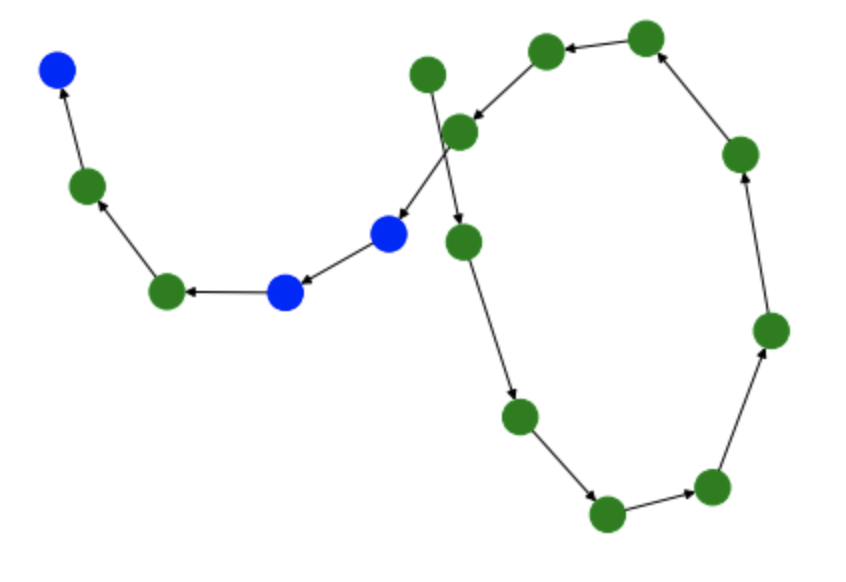

> \<!\-\--Licensed to the Apache Software Foundation (ASF) under one or
> more contributor license agreements. See the NOTICE file distributed
> with this work for additional information regarding copyright
> ownership. The ASF licenses this file to You under the Apache License,
> Version 2.0 (the \"License\"); you may not use this file except in
> compliance with the License. You may obtain a copy of the License at
>
> > <http://www.apache.org/licenses/LICENSE-2.0>
>
> Unless required by applicable law or agreed to in writing, software
> distributed under the License is distributed on an \"AS IS\" BASIS,
> WITHOUT WARRANTIES OR CONDITIONS OF ANY KIND, either express or
> implied. See the License for the specific language governing
> permissions and limitations under the License. \-\--\>

# Example Usage of Distill

In this example, we run through a simulated user experiment using
UserALE data generated within an instantiation of Superset. This data
reflects four simulated user sessions in which the user performs three
tasks within the Video Game Sales example dashboard:

1.  Filter the Video Games Sales by Wii, Racing, and Nintendo.
2.  Find Mario Kart in the list of games.
3.  Determine the difference in global sales between the 3DS game
    Nintendogs + cats and Wii Sports.

A screenshot of this Superset dashboard can be seen below:

{width="700px"}

The data of these four sessions is captured in a JSON file entitled
[task_example.json]{.title-ref}. In the following example, we will:

-   Show how to use Distill\'s Segmentation package to create useful
    `Segments` of data.
-   Visualize `Segment` objects using timeline/gantt and digraph
    visualizations.
-   Compare each of these user sessions through the investigation of
    edit distances.

**Note: The data utilized in this example was not data collected in any
user study. Rather this data is simulated through developer interactions
with the Superset dashboard.**

## Imports

The first step in this example is to import all of the packages that we
need. We do this with the code below:

``` python
import datetime
import distill
import json
import networkx as nx
import os
import pandas as pd
import plotly.express as px
import re
```

## Processing and Segmentation

Now that we have imported all of the necessary packages, we can begin to
process and segment the data. This can be done by creating
`Segment`/`Segments` objects. These objects will help us to visualize
the data and understand processes that the users took to perform each of
the three tasks.

### Processing the JSON File

The `setup` function is used to convert a JSON file into the required
format for segmentation. It also allows us to assert the date format
that we want to use for our analysis (i.e., integer or `datetime`).
Below we define this function:

``` python
def setup(file, date_type):
    with open(file) as json_file:
        raw_data = json.load(json_file)

    data = {}
    for log in raw_data:
        data[distill.getUUID(log)] = log

    # Convert clientTime to specified type
    for uid in data:
        log = data[uid]
        client_time = log['clientTime']
        if date_type == "integer":
            log['clientTime'] = distill.epoch_to_datetime(client_time)
        elif date_type == "datetime":
            log['clientTime'] = pd.to_datetime(client_time, unit='ms', origin='unix')

    # Sort
    sorted_data = sorted(data.items(), key=lambda kv: kv[1]['clientTime'])
    sorted_dict = dict(sorted_data)

    return (sorted_data, sorted_dict)
```

Using this function, we can process the UserALE data and create
`Segment` objects that represent each of the four user sessions. This is
shown below through the utilization of the
`generate_collapsing_window_segments` function.

``` python
data_many_session = setup("./data/task_example.json", "datetime")
sorted_dict = data_many_session[1]

# Create segments based on sessionID
segments = distill.Segments()
session_ids = sorted(distill.find_meta_values('sessionID', sorted_dict), key=lambda sessionID: sessionID)
for session_id in session_ids:
    segments.append_segments(distill.generate_collapsing_window_segments(sorted_dict, 'sessionID', [session_id], session_id))

# Improve readability of Segment names
for index in range(len(segments)):
    segments[index].segment_name = "Session" + str(index)
```

Below we list out each of the created `Segment` objects along with their
number of logs and start times.

``` console
Session0   Length: 427   Start Time: 2022-05-16 21:25:57.935000
Session1   Length: 236   Start Time: 2022-05-16 21:27:38.283000
Session2   Length: 332   Start Time: 2022-05-16 21:28:59.774000
Session3   Length: 219   Start Time: 2022-05-16 21:30:25.633000
```

### Further Segmentation of Sessions

Now that there are `Segment` objects that represent each session, let\'s
write the `Segment` objects. This will allow us to further segment these
session segments to analyze the activity of the user during each of
these sessions. This can be done with the following code:

``` python
segment_names = [segment.segment_name for segment in segments]
start_end_vals = [segment.start_end_val for segment in segments]
segment_map = distill.write_segment(sorted_dict, segment_names, start_end_vals)
```

We can now generate `Segments` objects within each of those session
segments that represent user interactions on two different elements of
the Superset dashboard.

The first element involves user interactions with the filter window that
filters the list of video games (shown in the screenshot below). The
element in the path that represents these interactions is
\"div.filter-container css-ffe7is.\"

{width="500px"}

The second element involves interactions with the actual list of video
games (shown in the screenshot below) represented by the
\"div#chart-id-110.superset-chart-table\" path element.

{width="500px"}

By creating `Segment` objects that show user interaction on these two
windows, we can get an understanding of how the user is using the
Superset dashboard to complete the three tasks. We create these
`Segment` objects with the following code:

``` python
session_0_segments = distill.generate_collapsing_window_segments(segment_map['Session0'], 'path', ['div.filter-container css-ffe7is'], "Game_Filter")
session_1_segments = distill.generate_collapsing_window_segments(segment_map['Session1'], 'path', ['div.filter-container css-ffe7is'], "Game_Filter")
session_2_segments = distill.generate_collapsing_window_segments(segment_map['Session2'], 'path', ['div.filter-container css-ffe7is'], "Game_Filter")
session_3_segments = distill.generate_collapsing_window_segments(segment_map['Session3'], 'path', ['div.filter-container css-ffe7is'], "Game_Filter")

session_0_segments.append_segments(distill.generate_collapsing_window_segments(segment_map['Session0'], 'path', ['div#chart-id-110.superset-chart-table'], "Games"))
session_1_segments.append_segments(distill.generate_collapsing_window_segments(segment_map['Session1'], 'path', ['div#chart-id-110.superset-chart-table'], "Games"))
session_2_segments.append_segments(distill.generate_collapsing_window_segments(segment_map['Session2'], 'path', ['div#chart-id-110.superset-chart-table'], "Games"))
session_3_segments.append_segments(distill.generate_collapsing_window_segments(segment_map['Session3'], 'path', ['div#chart-id-110.superset-chart-table'], "Games"))
```

Now, we append each of those newly generated `Segments` objects to the
overarching segments variable. This will create one large `Segments`
object that contains all `Segment` objects from all sessions.

``` python
segments.append_segments(session_0_segments)
segments.append_segments(session_1_segments)
segments.append_segments(session_2_segments)
segments.append_segments(session_3_segments)
```

## Visualization of `Segment` Objects

To understand these `Segment` objects better, we can visualize them.
First, we will visualize them using Plotly\'s timeline function, then we
will analyze them by creating DiGraphs.

### Visualization with Plotly\'s Timeline

The following code can be used to define a function that will display a
Plotly timeline of each of the `Segment` objects:

``` python
def display_segments(segments):
    segment_list = []
    for segment in segments:
        if not isinstance(segment.start_end_val[0], datetime.datetime) or not isinstance(segment.start_end_val[1], datetime.datetime):
            new_segment = distill.Segment()
            new_segment.segment_name = segment.segment_name
            new_segment.num_logs = segment.num_logs
            new_segment.uids = segment.uids
            new_segment.generate_field_name = segment.generate_field_name
            new_segment.generate_matched_values = segment.generate_matched_values
            new_segment.segment_type = segment.segment_type
            new_segment.start_end_val = (pd.to_datetime(segment.start_end_val[0], unit='ms', origin='unix'), pd.to_datetime(segment.start_end_val[1], unit='ms', origin='unix'))
            segment_list.append(new_segment)
        else:
            segment_list.append(segment)
    new_segments = distill.Segments(segments=segment_list)
    distill.export_segments("./test.csv",new_segments)
    df = pd.read_csv("./test.csv")
    fig = px.timeline(df, x_start="Start Time", x_end="End Time", y="Segment Name", color="Number of Logs")
    fig.update_yaxes(autorange="reversed")
    os.remove("./test.csv")
    fig.show()
```

Using this code, we can visualize the `Segment` objects we created.

``` python
display_segments(segments)
```

This will produce the following timeline graph:

{width="700px"}

This graph shows the number of logs in each `Segment` while also showing
the length of time each `Segment` represents. We can also begin to
understand some of the interactions that each user had with the
dashboard by analyzing the `Segment` objects that exist within each
overarching session `Segment`.

### Visualizing User Workflows with DiGraphs

Another way we can visualize user workflows is through the creation and
analysis of DiGraphs. The function below (`draw_digraph`) draws a
DiGraph based on the passed in `Segments` object. These graphs are
colored in such a way that interactions with the video game filter are
colored in green while the interactions with the list of video games are
colored in blue.

``` python
def draw_digraph(segments):
    nodes = sorted(segments.get_segment_list(), key=lambda segment: segment.start_end_val[0])
    edges = distill.pairwiseSeq(segments.get_segment_list())

    # Set coloring of graph based on element in Superset dashboard
    color_map = []
    for segment in segments:
        if re.match("Game_Filter\S*", segment.segment_name):
            color_map.append('green')
        else:
            color_map.append('blue')

    graph = distill.createDiGraph(nodes, edges)
    nx.draw(graph, node_color=color_map)
    return graph
```

We can now use this function to create DiGraphs of each of the user
sessions.

**Graph 0 - Session 0**

``` python
G0 = draw_digraph(session_0_segments)
```

{width="400px"}

**Graph 1 - Session 1**

``` python
G1 = draw_digraph(session_1_segments)
```

{width="400px"}

**Graph 2 - Session 2**

``` python
G2 = draw_digraph(session_2_segments)
```

{width="400px"}

**Graph 3 - Session 3**

``` python
G3 = draw_digraph(session_3_segments)
```

{width="400px"}

By analyzing these graphs, we can understand the general interactions
that users had with the two elements of the Superset dashboard. For
instance, in each of these graphs, the user starts by filtering the
dashboard. Based on the tasks that the user is meant to perform, this
makes a lot of sense since the most logical way to filter the dashboard
is through the filtering window. However, these graphs begin to differ
in the amount of interactions that the user has with the actual list of
video games. While users always follow the workflow: filter \--\> game
list \--\> filter \--\> game list, there are occasions when the user
interacts more with the game list than others.

## Measuring Similarity with Edit Distance

One way to understand the differences between the previously generated
DiGraphs is to look at their edit distance. Edit distance is a metric
that measures how many distortions are necessary to turn one graph into
another, thus measuring similarity. For instance, taking the edit
distance between a graph and itself yields an edit distance of 0, since
the graphs are exactly the same. We can show this using NetworkX\'s
`graph_edit_distance` to calculate the edit distance.

**Input**

``` python
nx.graph_edit_distance(G0, G0)  # 0.0
```

Let\'s now calculate the edit distances between each graph to calculate
an average. Note, however, that when we try to calculate some edit
distances, we run into a bit of an issue. Since edit distance is a
computationally complex problem, it can take a long time and require
large amounts of computational resources to find an exact answer. To
simplify this problem, we can use NetworkX\'s
`optimize_graph_edit_distance` function which will create an
approximation of the graph edit distance. For the following
calculations, we use the function required depending on the length of
time `graph_edit_distance` takes in each circumstance.

**Input: G0, G1**

``` python
next(nx.optimize_graph_edit_distance(G0, G1))   # 32.0
```

**Input: G0, G2**

``` python
next(nx.optimize_graph_edit_distance(G0, G2))   # 34.0
```

**Input: G0, G3**

``` python
next(nx.optimize_graph_edit_distance(G0, G3))   # 38.0
```

**Input: G1, G2**

``` python
nx.graph_edit_distance(G1, G2)   # 2.0
```

**Input: G1, G3**

``` python
next(nx.optimize_graph_edit_distance(G1, G3))   # 18.0
```

**Input: G2, G3**

``` python
nx.graph_edit_distance(G2, G3)   # 4.0
```

Using these outputs we can now calculate the average edit distance with
the following calculation:

``` python
(32.0 + 34.0 + 38.0 + 2.0 + 18.0 + 4.0)/6   # 21.33
```

This shows that the average edit distance between each of these session
DiGraphs is 21.33.
