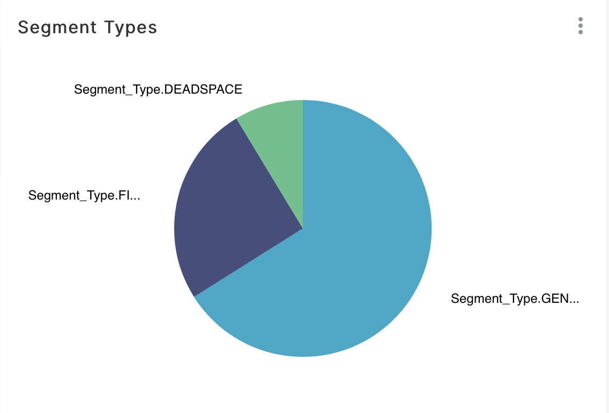
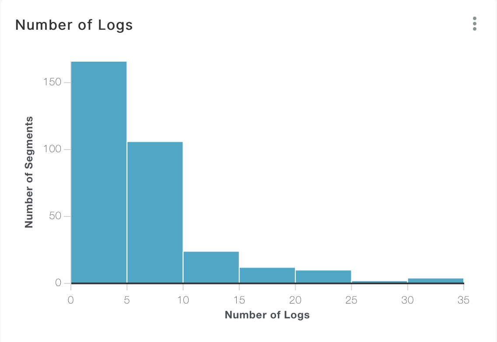
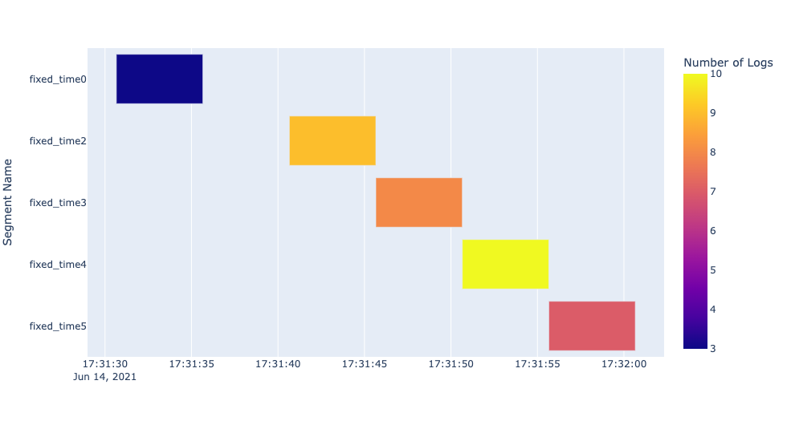

> \<!\-\--Licensed to the Apache Software Foundation (ASF) under one or
> more contributor license agreements. See the NOTICE file distributed
> with this work for additional information regarding copyright
> ownership. The ASF licenses this file to You under the Apache License,
> Version 2.0 (the \"License\"); you may not use this file except in
> compliance with the License. You may obtain a copy of the License at
>
> > <http://www.apache.org/licenses/LICENSE-2.0>
>
> Unless required by applicable law or agreed to in writing, software
> distributed under the License is distributed on an \"AS IS\" BASIS,
> WITHOUT WARRANTIES OR CONDITIONS OF ANY KIND, either express or
> implied. See the License for the specific language governing
> permissions and limitations under the License. \-\--\>

# Exporting Segments

`Segments` objects can be exported into csv files for further analysis.
Distill provides a simple function to do this: `export_segments`. This
function will take in the path to place the new file along with a
`Segments` object and output a new csv with each `Segment` on a new
line. Note that this function will not currently export user defined
attributes that are not inherently within a `Segment` object. This
function can be used as follows:

``` python
# Segments object
segments

# Export segments into a csv file
distill.export_segments("./test.csv", segments)
```

The above code will create a csv file in the current directory entitled
\"test.csv\". An example of what this file looks like with two `Segment`
objects can be seen below:

``` console
Segment Name,Start Time,End Time,Number of Logs,Generate Field Name,Generate Matched Values,Segment Type
segment1,0,1,5,type,['click'],Segment_Type.GENERATE
segment2,2,3,6,type,['click'],Segment_Type.GENERATE
```

## Visualization Examples

One specific benefit of exporting `Segment` objects into a csv file is
the ability for those `Segment` objects to be visualized using
pre-existing visualization software. Through the returned csv file, we
have been successful in building visualizations through both Apache
Superset and Plotly. Below are example visualizations from each
software:

### Apache Superset

By importing our `Segment` csv file, we can create a variety of useful
visualizations with [Apache\'s Superset](https://superset.apache.org).
Below are a few example screenshots from Superset:

**Pie Chart indicating the different Segment types.**

{width="700px"}

**Bar Chart indicating the number of Segment objects with a given number
of logs.**

{width="700px"}

**Timeline showing the Number of Logs by Segment start time.**

{width="700px"}

### Plotly

[Plotly](https://plotly.com/python/) is another visualization tool that
can be used to generate useful graphs and charts. One chart that we
found particularly useful was the ability to visualize `Segment` objects
within a Gantt chart. Below is an example use of this chart.

To create the chart, the following code can be used assuming a csv file
entitled [example_segments.csv]{.title-ref} exists in the current
directory and this file represents start and end times in the python
`datetime` formatting:

``` python
import pandas as pd
import plotly.express as px

df = pd.read_csv("./example_segments.csv")
fig = px.timeline(df, x_start="Start Time", x_end="End Time", y="Segment Name", color="Number of Logs")
fig.update_yaxes(autorange="reversed")
fig.show()
```

The above code will create a Gantt chart similar to the screenshot shown
below:

{width="700px"}

In addition, [Plotly\'s Dash](https://plotly.com/dash/) can be used to
create useful dashboards that display Plotly plots. An example of this
can be seen in the video below:

```{=html}
<video width=700 autoplay loop controls><source src="_images/dash.mp4" type="video/mp4"></video>
```
